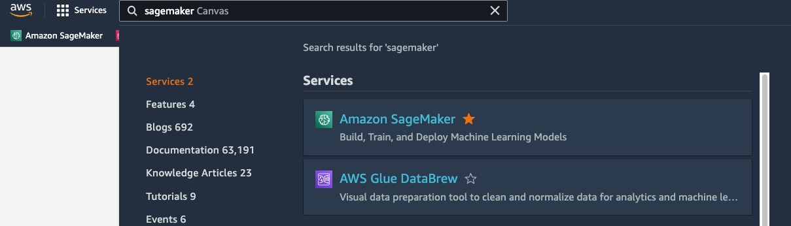
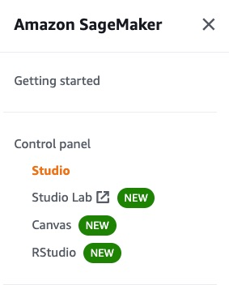
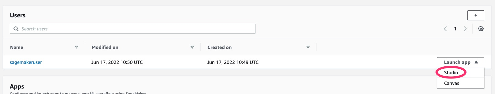

# Workshop - Introduction to machine learning using Python on AWS

In this workshop you will train a machine learning model based on a sample use case using structured data. This workshop is intended for novice machine learning practitioners with no prior ML experience!

We will start with data preparation using Pandas and then train an XGBoost classification model on our notebook instance. Finally we will learn how to start our first step to productionizing this model utilizing Amazon SageMaker Training jobs and endpoints.

## Prerequisites:

The first part of this workshop requires a running Jupyter notebook environment, for Lab 3 you will require an AWS account and a JupyterLab environment like SageMaker Studio.

If you are at an AWS event, follow [this link](https://dashboard.eventengine.run/login) and type in the event hash to get access to an AWS account:


## Getting started

To get started clone the repositroy and open [01-Lab-Data-Prep-with-Pandas.ipynb](01-Lab-Data-Prep-with-Pandas.ipynb) in Jupyter.

### Detailed getting started instructions using SageMaker Studio:

1. Open [AWS console](https://console.aws.amazon.com/console/home)
1. Type in SageMaker into the search box an dopen SageMaker

1. Select Studio on the left

1. Select Launch Studio

1. Select Launch App --> Studio

1. Open System Terminal 

1. Clone the repository 
```bash
git clone https://github.com/johanneslanger/ml-immersion-day
```
1. Then open following notebook using the filebrowser on the left:
`ml-immersion-day/01-Lab-Data-Prep-with-Pandas.ipynb`
