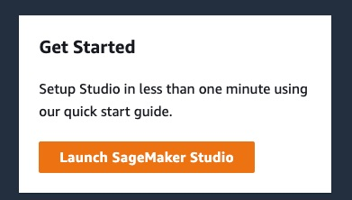

# Workshop - Introduction to machine learning using Python on AWS

In this workshop we will train our first machine learning model based on a sample use case using structured data. 

We will start with data preparation using Pandas and then train an XGBoost classification model on our notebook instance. Then we will learn how to start our first step to productionizing this model utilizing Amazon SageMaker Training jobs and endpoints.

## Prerequisites:

The first part of this workshop requires a running Jupyter notebook environment, for Lab 3 you will require an AWS account and a JupyterLeb environment like SageMaker Studio.

If you are at an AWS event follow [this link](https://dashboard.eventengine.run/login) and type in the vent hash to get access to an AWS account:
Getting startet


## Getting started

To get started clone the repositroy and open [01-Lab-Data-Prep-with-Pandas.ipynb](01-Lab-Data-Prep-with-Pandas.ipynb) in Jupyter.

### Detailed instructions using SageMaker Studio:

1. Open [AWS console](https://console.aws.amazon.com/console/home)
1. Type in SageMaker into the search box an dopen SageMaker

1. Select Studio on the left

1. Select Launch Studio

1. Select Launch App --> Studio

1. Open System Terminal 

1. Clone the repository 
```bash
git clone https://github.com/johanneslanger/ml-immersion-day
```
1. Then open following notebook using the filebrowser on the left:
`ml-immersion-day/01-Lab-Data-Prep-with-Pandas.ipynb`
